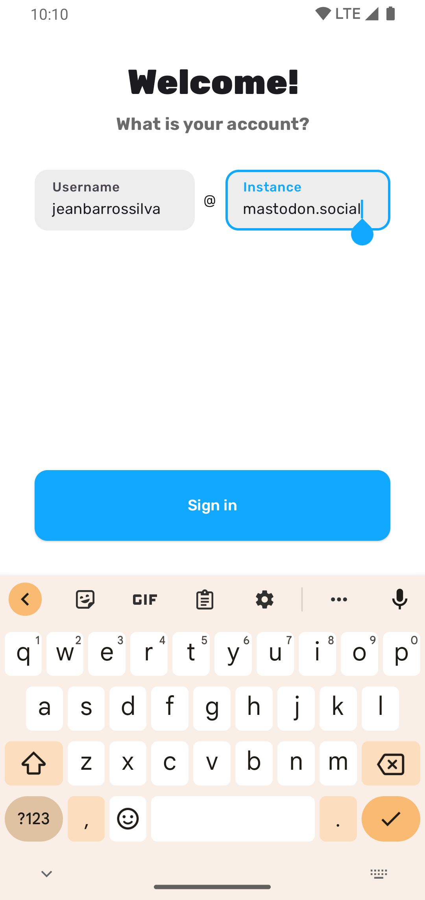
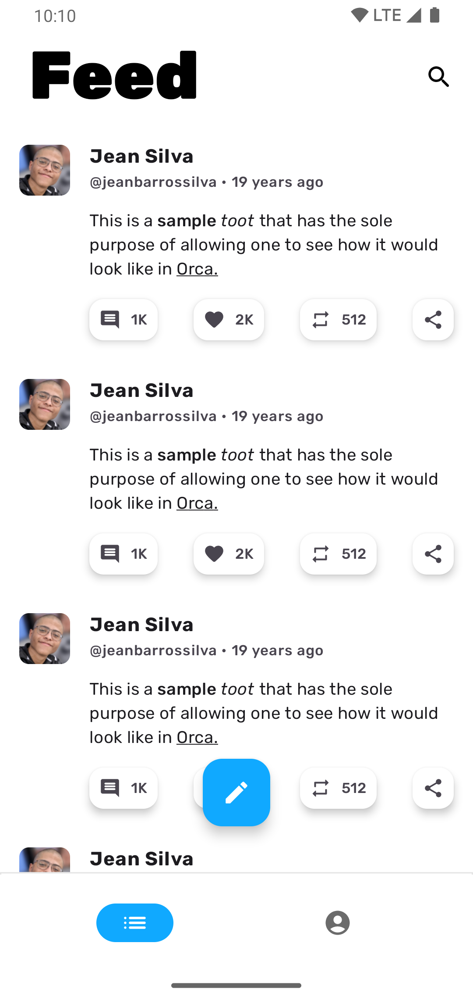
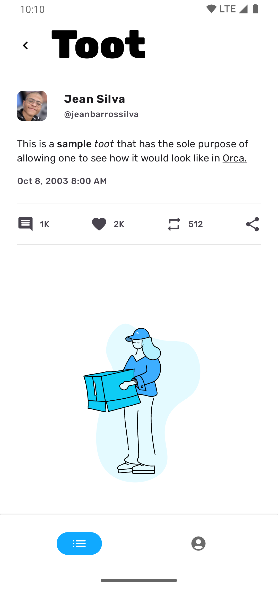
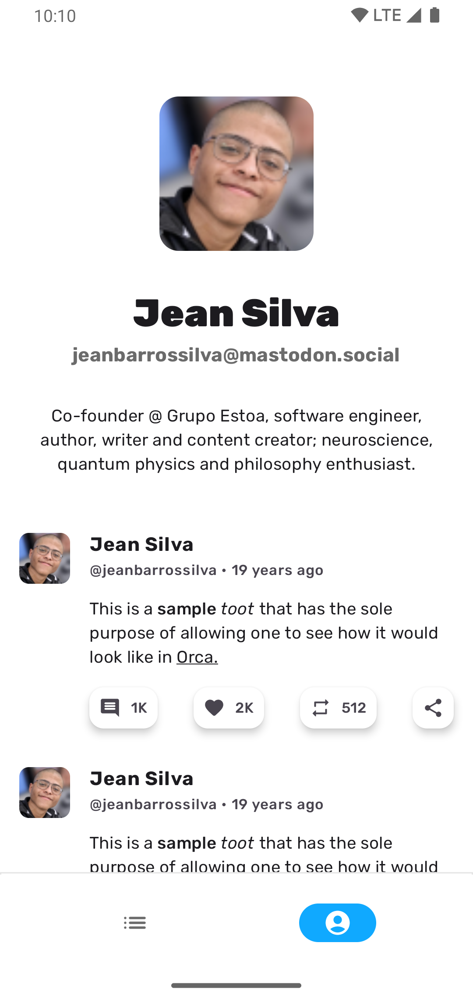

    

<h3 align="center">Orca</h3>

    Experience Mastodon to its fullest.

<h2>About</h2>

    
    
    
    

    Orca is a beautifully designed, fully functional Mastodon client that offers you the best
    experience you could have.

